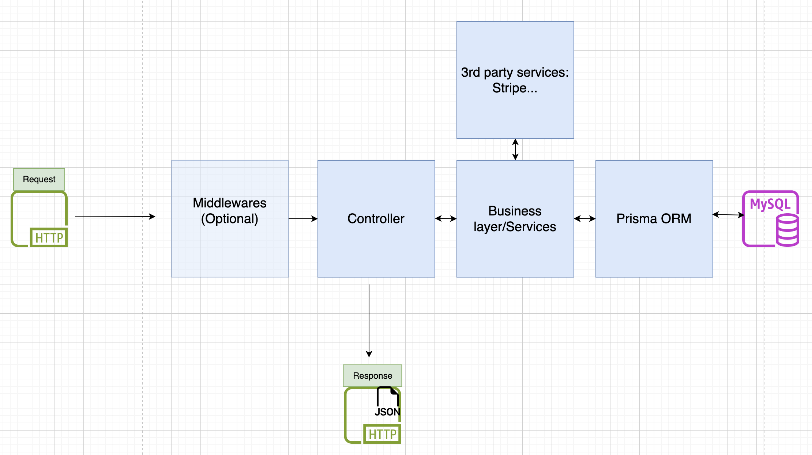

## Node TypeScript Starter Project

A starter project demonstrating a basic setup of a Node Express API including the setup of Prisma ORM with MySQL

### Project structure



```
├── prisma
├── src
│   ├── __tests__
│   ├── controllers
│   ├── middlewares
│   ├── routes
│   ├── services
│   ├── app.ts - configure the express app
│   ├── index.ts - start the express server
├── tsconfig.json
├── .eslintrc
├── .prettierrc
├── .env
├── .env.example
├── package.json
├── yarn.lock
└── README.md
```

### Prerequisites

- Install node v20+ (Recommended install via [nvm](https://github.com/nvm-sh/nvm))
- Install npm v9+
- Install yarn package manager
- MySQL database server running

### Features

- Functional based approach supporting pure functions with dependency injection
- Setup of [Prisma ORM](https://www.prisma.io/) with MySQL provider
- Generation of swagger UI with [express-jsdoc-swagger](https://brikev.github.io/express-jsdoc-swagger-docs/#/)
- Use of [dotenv](https://www.npmjs.com/package/dotenv) to load environment variables from .env file
- Prefix versioning of routes
- Setup of eslint and prettier for code formatting and enforcing code standards
- Setup of testing environment with jest and supertest
- Generation of .gitignore with [gitignore.io](https://www.toptal.com/developers/gitignore)
- Use [fakerjs](https://fakerjs.dev/) for generating fake test data

<br>

# API Documentation

http://localhost:3000/api-docs/

<br>

# Install & run locally

Ensure that `.env` file contains the MySQL Connection string in the `DATABASE_URL` variable

```
nvm use 20
yarn install
yarn dev
```

<br>

# Test

`yarn test`

<br>

# Prisma ORM

https://www.prisma.io/docs/getting-started/setup-prisma/add-to-existing-project/relational-databases-typescript-mysql

### Setup Prisma in an existing project and Baseline your Database

This setup should only be done ONCE. We need to do this to initialize the migration history for an existing database.

- `npx prisma init`: creates the new directory called "prisma" that contains the file "schema.prisma"

- `npx prisma db pull`: reads the database schema and translates it into a Prisma data model

- `mkdir -p prisma/migrations/0_init`: "migrations" folder will contain all the migrations. "0_init" is the first migration

- `npx prisma migrate diff --from-empty --to-schema-datamodel prisma/schema.prisma --script > prisma/migrations/0_init/migration.sql` : generates the migration file

- `npx prisma migrate resolve --applied 0_init`: mark the migration as applied. We now have a baseline for the current database schema.

### How to apply changes to existing migrations?

- Update the schema inside `prisma/schema.prisma` with the necessary changes
- `npx prisma migrate dev --name <NAME>`: Use this command to make further changes to your database schema.

<br>

### Dependency management

Add a new dependency:

- `yarn add <package_name>`

Add a new development dependency:

- `yarn add <package_name> --save-dev`

<br>

### Create a deployable version

`yarn start`: will compile your application according to the configurations in the `tsconfig.json` file, create a `build` folder and invoke the compiled JS server file
